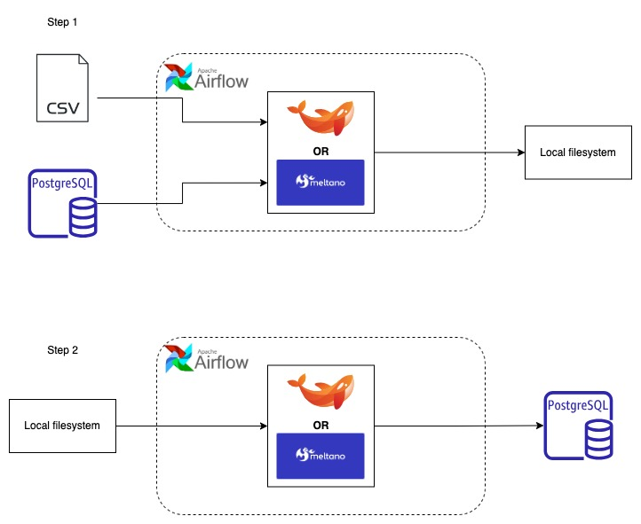

# Indicium Tech Code Challenge

Code challenge for Software Developer with focus on data projects.


## Context

At Indicium, we undertake various projects involving the development of end-to-end data pipelines. These projects encompass extracting data from diverse sources and loading it into its final destination, which could range from a data warehouse for a Business Intelligence tool to an API for integration with third-party systems.

As a software developer specializing in data projects, your mission is to plan, develop, deploy, and maintain a data pipeline.


## The Challenge

We will provide two data sources: a PostgreSQL database and a CSV file. The CSV file contains details of orders from an ecommerce system.

The provided database is a sample database named Northwind, provided by Microsoft for educational purposes. The only difference is that the order_detail table does not exist in this database; instead, it is represented by the CSV file we provide.

Schema of the original Northwind Database: 


Your challenge is to build a pipeline that extracts data daily from both sources. The data should be written first to the local disk and then to a PostgreSQL database. While the CSV file and the database are static for this challenge, in a real-world scenario, both data sources would be constantly changing.

It's essential that all writing steps (from inputs to local filesystem and from local filesystem to PostgreSQL) are isolated from each other. Each step should be executable independently.

For the first step, where data is written to the local disk, you should write one file for each table. This pipeline will run every day, so there should be a separation in the file paths for each source (CSV or Postgres), table, and execution day combination. For example:

```
/data/postgres/{table}/2024-01-01/file.format
/data/postgres/{table}/2024-01-02/file.format
/data/csv/2024-01-02/file.format
```

You are free to choose the naming and format of the files you save.

In step 2, you should load the data from the local filesystem (created in step 1) to the final database.

The final goal is to run a query that shows the orders and their details. The Orders are placed in a table called orders in the PostgreSQL Northwind database. The details are in the CSV file provided, with each line having an order_id field pointing to the orders table.

## Solution Diagram

As Indicium uses some standard tools, the challenge was designed to be done using some of these tools.

The following tools should be used to solve this challenge:

Scheduler:

Airflow
Data Loader:

Embulk (Java Based) OR Meltano (Python Based)
Database:

PostgreSQL
The solution should be based on the diagrams below:



### Requirements

Use the tools described above.
Ensure all tasks are idempotent; running the pipeline every day should yield the same output.
Step 2 depends on both tasks of step 1, preventing running step 2 for a day if the tasks from step 1 did not succeed.
Extract all tables from the source database, even if not all are used for the final step.
Clearly indicate where the pipeline failed, making it evident which step to rerun.
Provide clear instructions on running the entire pipeline.
Provide evidence that the process has been completed successfully, such as a CSV or JSON with the result of the described query.
Assume the pipeline will run for different days every day.
Allow the pipeline to run for past days, meaning it should process data for a specified day. The only difference for each day of execution is the output paths, as the data for this challenge is static.

### Things that Matters

Clean and organized code.
Good decisions at each step (database, file format, etc.) with justifications.
The challenge aims to assess technical knowledge and the ability to solve problems using tools that may not be familiar to the candidate.
Point-and-click tools are not allowed.
Thank you for participating!